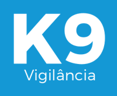

  

Desenvolvido com viés escolar o site K9 vigilância é um site que oferece serviços de aluguel de cão de guarda, treinados e mostra suas características e propriedades.

# Desenvolvedores:
* Victor dos Santos Ribeiro
* Lucas Koichi Kawakami 

# Tecnologias Utilizadas:
* Bootstrap
* WoW
* API Google Maps
* Animate
* JQuery
* Photoshop
